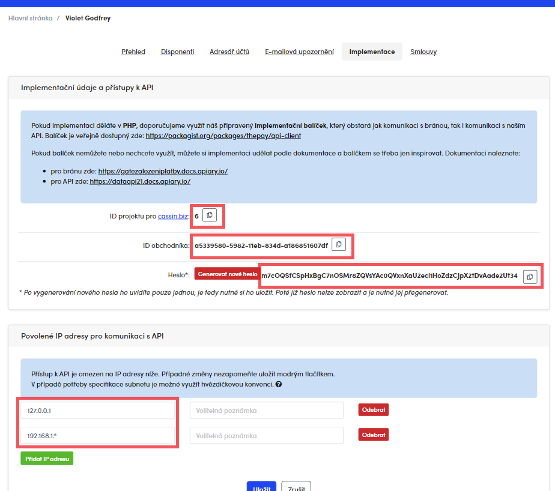

#  PHP SDK for ThePay.cz

This is the official highly compatible public package of The Pay SDK which
interacts with The Pay's REST API. To get started see examples below.

## Requirements

All necessary requirements are defined in [composer.json](../composer.json) `require` property.
We strongly recommend SDK installation using [Composer](https://getcomposer.org/)!

## Installation

```console
composer require thepay/api-client
```

Installation with suggested PSR http client.

```console
composer require thepay/api-client guzzlehttp/guzzle
```

This project adheres to [Semantic Versioning](https://semver.org/spec/v2.0.0.html).

## Support & Contributions

If you find any bug, please submit the [issue](https://github.com/ThePay/api-client/issues/new/choose) to Github directly.

Feel free to contribute via Github [issues](https://github.com/ThePay/api-client/issues) and
[pull requests](https://github.com/ThePay/api-client/pulls). We will respond as soon as possible.
Please keep in mind the backwards compatibility and do not change the requirements without previous admin agreement.

## Preconditions
### Testing the integration
**To test the integration** you can create simplified "ready-to-go" DEMO account in our [DEMO environment](https://demo.admin.thepay.cz/registration).

You can find all the necessary credentials in "Implementation" section under your merchant profile:



### Access credentials
Make sure that you have all required credentials and that you've set up the API access in [administration](https://admin.thepay.cz), in the Implementation section. The required credentials are:
- merchant ID
- project ID
- password for API access

### IP address whitelisting
You must whitelist the IP address of the machine which will be accessing the API in project settings.
You can use a particular IP address or specify a range. The whitelisting setup can be found in the same place as the credentials, that is the Implementation section of the administration.

## Usage

You will work with two classes when using this SDK.
- TheConfig - for setting up the library
- TheClient - for core functionality (calling the API, rendering helpers)

## Configuration with TheConfig

All constructor parameters are described in [php doc](../src/TheConfig.php)

```php
$merchantId = '86a3eed0-95a4-11ea-ac9f-371f3488e0fa';
$projectId = 3;
$apiPassword = 'secret';
$apiUrl = 'https://demo.api.thepay.cz/'; // production: 'https://api.thepay.cz/'
$gateUrl = 'https://demo.gate.thepay.cz/'; // production: 'https://gate.thepay.cz/'
$language = 'cs';

$theConfig = new \ThePay\ApiClient\TheConfig(
    $merchantId,
    $projectId,
    $apiPassword,
    $apiUrl,
    $gateUrl
);

$theConfig->setLanguage($language);
```

## TheClient instance

Before creating the `\ThePay\ApiClient\TheClient` instance, some dependencies must be prepared first.

### With dependency injection
If you're using automatic dependency injection (as most frameworks do), all dependencies except `TheConfig`
(which you configured in the previous section) will be injected automatically - including PSR-standard interfaces,
provided your application already includes implementations of them.

### Without dependency injection
In case you are not using dependency injection, you will have to setup the classes manually yourself,
as in the following example:

```php
/** @var \ThePay\ApiClient\TheConfig $theConfig */

// TheClient instance dependencies
$signatureService = new \ThePay\ApiClient\Service\SignatureService($theConfig);
/** @var \Psr\Http\Client\ClientInterface $httpClient some PSR-18 implementation */
/** @var \Psr\Http\Message\RequestFactoryInterface $requestFactory some PSR-17 implementation */
/** @var \Psr\Http\Message\StreamFactoryInterface $streamFactory some PSR-17 implementation */
// if you install suggested guzzle implementation you can use this:
// $httpClient = new \GuzzleHttp\Client();
// $requestFactory = $streamFactory = new \GuzzleHttp\Psr7\HttpFactory();
$apiService = new \ThePay\ApiClient\Service\ApiService(
    $theConfig,
    $signatureService,
    $httpClient,
    $requestFactory,
    $streamFactory
);

$thePayClient = new \ThePay\ApiClient\TheClient(
    $theConfig,
    $apiService
);
```

## Usual payment workflow

There are three steps when creating a payment:
- creating a payment link through which the customer will realize the payment
- handling the return of customer to your website
- handling server to server notification, which are sent by us everytime the payment state is changed

All of these steps will need to be implemented by yourself, but fear not, we have prepared examples that you can take on your journey through our SDK.

### 1. Payment creation
#### REST API

The payment is created via the REST API, after which the customer is typically redirected to the URL provided in the response.

```php

/** @var \ThePay\ApiClient\TheClient $thePayClient */

// Specify the payment parameters (100,- Kč) including it's unique identifier
$paymentParams = new \ThePay\ApiClient\Model\CreatePaymentParams(10000, 'CZK', 'uid124');

// Get the payment link and redirect customer whenever you want
$payment = $thePayClient->createPayment($createPayment);
$redirectLink = $payment->getPayUrl();
```
For more details and examples see [create-payment.md](../doc/create-payment.md)

#### Payment method
You have two options, regarding whether the payment method is preselected or not:
- Payment method preselected in your e-shop
- Payment method NOT preselected - the customer will select payment method at ThePay gate

The payment method can be preselected on your side simply by adding a parameter to the API call for payment creation.
By using this approach you can fully customize how you want to display the payment methods in your e-shop.

If you do not preselect the payment method, the customer will be presented with payment method selection upon
visiting ThePay gate through the generated link.

Note, that even if you (or your customer) do preselect the payment method, it can still be changed
after redirection by the customer, unless specifically forbidden.
Once again, this can be achieved by adding a parameter to the payment creation API call.

#### Payment amount is unchangeable

Please note that the amount for which the payment was created cannot be changed later.

This means if the order is updated on your side and the final amount of the payment changes,
you will need to initiate a new payment via a new API call with the updated amount (and a new unique identifier).

Once a payment is created, it is not possible to modify the amount.

#### Payment flow and changes

You should always create only one payment (with its unique UID) for each order in your e-shop.
This means that if the customer navigates back and forth, they should use the same payment link to complete the process.

A new payment should be created only if the order itself changes (e.g., the final amount changes).

#### TL;DR - summary
- The payment is created via a call to our API.
- The payment method selection can be done either in your e-shop or through ThePay gateway.
- Always create only one payment per order, regardless of how the payment is initiated — unless the payment amount changes. In that case, treat it as an entirely new payment.

### 2. Customer return

After a successful payment — or if the customer decides to return to the e-shop without completing the payment — they are redirected to the return URL.

#### Return URL address

The return URL should point to the page in your e-shop where you want the customer to land after leaving the payment gateway.

You can set the return URL either in ThePay administration or by passing it as a parameter when creating the payment.
- If the return URL is set in ThePay administration, the parameter is optional and will override the configured value if provided.
- If the return URL is not set in ThePay administration, then the parameter is required when creating the payment.

#### Query parameters
When the customer is redirected, two query parameters are appended to the URL:
- payment_uid
- project_id

These parameters can be used, for example, to distinguish between different projects if you use the same return endpoint for multiple e-shops.

#### Payment state check upon return

The payment state must always be verified when the customer returns to your e-shop, as it may not yet be in the "paid" state.
For example, the customer might return without completing the payment.

#### General example of handling the customer return

[See how to make TheClient](#theclient-instance)

```php

/** @var \ThePay\ApiClient\TheClient $thePayClient */

$payment = $thePayClient->getPayment($uid);

// check if the payment is paid
if ($payment->wasPaid()) {
    // Check if the order isn't labeled as paid yet in your e-shop. If not, do so here.
    // ...
}
```

### 3. Server to server notification

A payment may take some time to process, or the customer may not return to your e-shop (e.g., by closing the browser window).
You don’t need to worry about this — whenever the payment state changes, we will automatically send a server-to-server notification to your system.

Notifications are triggered every time the payment state changes, for example, when the payment is completed or expires.
Because not all state changes indicate a successful payment, you must always verify the current payment state upon receiving a notification to determine what has actually occurred.

#### Payment state check upon receiving a notification

The payment state check you perform here is the same as the one you should do when the customer returns to your e-shop.

[See how to make TheClient](#theclient-instance)

```php

/** @var \ThePay\ApiClient\TheClient $thePayClient */

$payment = $thePayClient->getPayment($uid);

// check if the payment is paid
if ($payment->wasPaid()) {
    // Check if the order isn't labeled as paid yet. If not, do so here.
    // ...
}
```

## More and detailed usage examples

You can find more usage examples at [folder /doc](../doc/index.md).

## Money calculations

For safe and accurate money calculations, we recommend using the [moneyphp/money](https://github.com/moneyphp/money) package.
Please do not use floats to store or calculate prices, as they can lead to precision errors.

```console
composer require moneyphp/money
```
