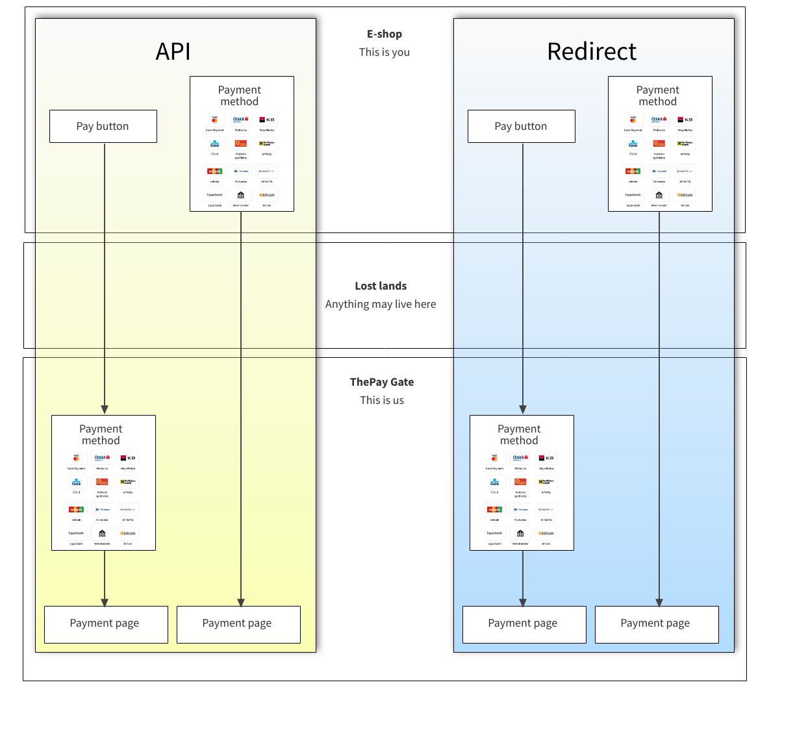

# SDK source moved to github

We decided to change the git repository hosting, from Bitbucket to [Github](https://github.com/ThePay/api-client)
mainly for better technical support, like reporting bugs and other problems,
using [Github Issues](https://github.com/ThePay/api-client/issues).
This repository will remain read only and any new changes or documentation updates will be done here:
[https://github.com/ThePay/api-client](https://github.com/ThePay/api-client).

<a href="https://github.com/ThePay/api-client">
    
</a>

#  PHP SDK for ThePay.cz

This is the official highly compatible public package of The Pay SDK which
interacts with The Pay's REST API. To get started see examples below.

## Requirements

- PHP 5.3+

**DEPRECATED VERSIONS**: 5.3, 5.4, 5.5, 5.6, 7.0, 7.1
**deprecated PHP versions** will be completely unsupported after 2023-01-01T00:00:00+01:00

**DEPRECATED VERSIONS**: 7.2, 7.3
**deprecated PHP versions** will be completely unsupported after 2023-06-09T00:00:00+02:00

- **curl** extension
- **json** extension

## Installation

To install the SDK we recommend to use [Composer](https://getcomposer.org/):

```console
composer require thepay/api-client
```

This project adheres to [Semantic Versioning](https://semver.org/spec/v2.0.0.html).

## Support & Contributions

If you find any bug, please submit the [issue](https://github.com/ThePay/api-client/issues/new/choose) in Github directly.

Feel free to contribute via Github [issues](https://github.com/ThePay/api-client/issues) and
[pull requests](https://github.com/ThePay/api-client/pulls). We will response as soon as possible.
Please have on mind the backwards compatibility and do not change requirements without previous admin agreement.

## Preconditions

Make sure that you have all required credentials and that you've set up the API access in [administration](https://admin.thepay.cz):

- merchant ID
- project ID
- password for API access
- enabled your IP address in project settings (you have to add IP address or IP address range of your server)

**To test the integration** you can create simplified "ready-to-go" DEMO account in our [DEMO environment](https://demo.admin.thepay.cz/registration).

You can find all the necessary credentials in "Implementation" section under your merchant profile:


## Usage

You will work with only two classes when using this SDK.
- TheConfig - for setting up the library
- TheClient - for main functionality (calling the API, rendering helpers)

## Configuration

All constructor parameters are described in [php doc](../src/TheConfig.php)

```php
$config = new ThePay\ApiClient\TheConfig(
    $merchantId,
    $projectId,
    $apiPassword,
    $apiUrl,
    $gateUrl
);

$config->setLanguage($language);
```

## Usual workflow

There are three steps when creating a payment:
- creating a link through which the customer will realize the payment
- hadling the return of customer to your website
- handling server to server notification, which are sent by us everytime the payment state is changed

All of these steps will need to be implemented by yourself, but fear not, we have prepared examples that you can take on your journey through our SDK.

### 1. Payment creation

The payment (link) can be created via two methods:
- REST API
- Redirection

No matter what method you choose, you have two more options, based on preselection of payment method:
- Payment method preselected in e-shop
- Payment method NOT preselected - the customer will select payment method at ThePay gate

Even if you (or your customer) preselect the payment method, it can still be changed after redirection, unless specifically forbidden.



#### REST API
You can create payment (link) via REST API and redirect user to that link. The payment itself is created through an API call.
This is the preferred way for custom forms and if you want to redirect user after the whole cart process is finished.

The payment method can be preselected on your side and simply added as payment parameter to the API.
Otherwise, the customer will be presented with payment method selection on visiting ThePay gate through generated link.

The payment link is returned to you in a response, upon calling the API endpoint for payment creation.

#### Redirection of customer
The second (simpler) method is to redirect customer to payment gate with payment parameters. The payment itself will be created as soon as customer is redirected.
This SDK will generate payment buttons which will do all the work.

The payment method can be preselected in your e-shop and simply added as payment parameter to the correct method.
Otherwise, the customer will be presented with payment method selection on visiting ThePay gate through generated link.

The payment link is generated by the SDK, upon using the method for generating the payment button/s.
The payment on our side is created at the moment the customer visits the link.

#### Payment amount is unchangeable
In case your order amount changes, a new payment needs to be created.

#### Payment flow and changes
You should always create only one payment (with its unique UID) for each order in your e-shop. You should never create new payments, except when changing the payment amount.

#### TL;DR - summary
These are the usual ways for payment creation:

- API - creating the payment through API call (selection of payment method either in e-shop or ThePay gate)
- Redirection with selection of payment method in ThePay gateway
- Redirection with selection of payment method in the e-shop

Always create only one payment for your order for all payment creation options, unless you need to change the payment amount. In that case, consider it a whole new payment.

For more examples see [create-payment.md](../doc/create-payment.md)

```php
use ThePay\ApiClient\TheConfig;
use ThePay\ApiClient\TheClient;
use ThePay\ApiClient\Model\CreatePaymentParams;

$merchantId = '86a3eed0-95a4-11ea-ac9f-371f3488e0fa';
$projectId = 3;
$apiPassword = 'secret';
$apiUrl = 'https://demo.api.thepay.cz/'; // production: 'https://api.thepay.cz/'
$gateUrl = 'https://demo.gate.thepay.cz/'; // production: 'https://gate.thepay.cz/'

$config = new TheConfig($merchantId, $projectId, $apiPassword, $apiUrl, $gateUrl);
$thePay = new TheClient($config);

// Render payment methods for payment (100,- Kč)
$paymentParams = new CreatePaymentParams(10000, 'CZK', 'uid124');

// display button, user will choose payment method at the payment gate
echo $thePay->getPaymentButton($paymentParams);

// or buttons with available payment methods, payment method will be preselected
// echo $thePay->getPaymentButtons($paymentParams);

// or just get payment link and redirect customer whenever you want
// $payment = $thePay->createPayment($createPayment);
// $redirectLink = $payment->getPayUrl();
```

### 2. Customer return

The customer is returned from ThePay gate to the return url address.

Return url is set in administration and customer gets redirected there with two query parameters added - payment_uid and project_id (needed if you have one endpoint for multiple projects).

The state of payment must be checked at the time of customer return, since the payment may not always be in the paid state at this time.
For example the customer simply returns to the e-shop without paying.

#### General example of handling the customer return
```php
use ThePay\ApiClient\TheConfig;
use ThePay\ApiClient\TheClient;
use ThePay\ApiClient\Model\CreatePaymentParams;

$uid = $_GET["payment_uid"];
$projectId = $_GET["project_id"];

$merchantId = '86a3eed0-95a4-11ea-ac9f-371f3488e0fa';
$apiPassword = 'secret';
$apiUrl = 'https://demo.api.thepay.cz/'; // production: 'https://api.thepay.cz/'
$gateUrl = 'https://demo.gate.thepay.cz/'; // production: 'https://gate.thepay.cz/'

$config = new TheConfig($merchantId, $projectId, $apiPassword, $apiUrl, $gateUrl);
$thePay = new TheClient($config);

$payment = $thePay->getPayment($uid);

// check if the payment is paid
if ($payment->wasPaid()) {
    // Check if the order isn't labeled as paid yet. If not, do so.
    // ...
}
```

### 3. Server to server notification

It's basically the same as second step (customer return), it's triggered everytime the payment has changed, for example when the state of payment has been changed.

```php
use ThePay\ApiClient\TheConfig;
use ThePay\ApiClient\TheClient;
use ThePay\ApiClient\Model\CreatePaymentParams;

$uid = $_GET["payment_uid"];
$projectId = $_GET["project_id"];

$merchantId = '86a3eed0-95a4-11ea-ac9f-371f3488e0fa';
$apiPassword = 'secret';
$apiUrl = 'https://demo.api.thepay.cz/'; // production: 'https://api.thepay.cz/'
$gateUrl = 'https://demo.gate.thepay.cz/'; // production: 'https://gate.thepay.cz/'

$config = new TheConfig($merchantId, $projectId, $apiPassword, $apiUrl, $gateUrl);
$thePay = new TheClient($config);

// check if the payment is paid
if ($payment->wasPaid()) {
    // Check if the order isn't labeled as paid yet. If not, do so.
    // ...
}
```

## More and detailed usage examples

You can find more usage examples at [folder /doc](../doc/index.md).

## Money calculations

For safe money calculations we recommend to use [moneyphp/money](https://github.com/moneyphp/money) package.
Please, do not use float to save information about prices because of its inaccuracy.

```console
composer require moneyphp/money
```
