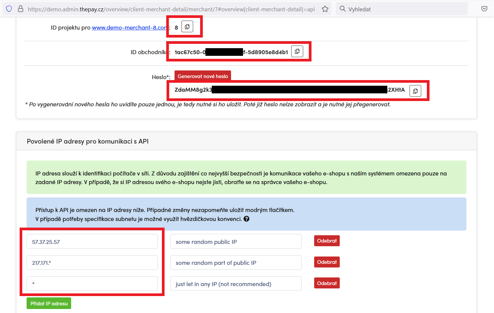

#  PHP SDK for ThePay.cz

This is the official highly compatible public package of The Pay SDK which
interacts with The Pay's REST API. To get started see examples below.

## Requirements

- PHP 5.3+
- **curl** extension
- **json** extension

## Installation

To install the SDK we recommend to use [Composer](https://getcomposer.org/):

    composer require thepay/api-client

## Preconditions

Make sure that you have all required credentials and that you've set up the API access in [administration](https://admin.thepay.cz):

- merchant ID
- project ID
- password for API access
- enabled your IP address in project settings (you have to add IP address of your server)

**To test the integration** you can create simplified "ready-to-go" DEMO account in our [DEMO environment](https://demo.admin.thepay.cz/registration).

You can find all the necessary credentials in "Implementation" section under your merchant profile:



## Configuration

```php
$config = new ThePay\ApiClient\TheConfig(
    $merchantId,
    $projectId,
    $apiPassword,
    $apiUrl,
    $gateUrl
);

$config->setLanguage($language);
```

| Argument | Type | Description |
| --- | --- | --- |
| `merchantId` | string | the identifier of merchant |
| `projectId` | int | the identifier of project, merchant may have a multiple projects |
| `apiPassword` | string | password for API, should not be the same as the password for logging into administration |
| `apiUrl` | string | base url for all API calls |
| `gateUrl` | string | gate application base url for user frontend |
| `language` | string | You may override this parameter later in request parameters, but this one will be used as a default value. The component requires format [ISO 639‑1](https://en.wikipedia.org/wiki/List_of_ISO_639-1_codes). Default value is **cs**. |

## Usual workflow

There are basicaly 3 steps that you should implement: at first, you have to create a link where customer will realize payment. Then you will handle return of customer to your website. Finally, you should handle server to server notification - we send them when the state of payment has been changed.

### 1. create payment

You can create payment (link) via REST API and redirect user to that link - this is prefered way for custom forms and if you want to redirect user after whole cart process finished. The second (simple) method is to redirect customer to payment gate with parameters (the payment will be created as soon as customer is redirected). This SDK will generate payment buttons which will do all the work.

No matter what method you will choose, you have two more options. The payment method could be preselected or not (the customer will select payment method at payment gate). Even if you (or your customer) preselect payment method, it could be changed after redirect.

```php
use ThePay\ApiClient\TheConfig;
use ThePay\ApiClient\TheClient;
use ThePay\ApiClient\Model\CreatePaymentParams;

$merchantId = '86a3eed0-95a4-11ea-ac9f-371f3488e0fa';
$projectId = 3;
$apiPassword = 'secret';
$apiUrl = 'https://demo.api.thepay.cz/'; // production: 'https://api.thepay.cz/'
$gateUrl = 'https://demo.gate.thepay.cz/'; // production: 'https://gate.thepay.cz/'

$config = new TheConfig($merchantId, $projectId, $apiPassword, $apiUrl, $gateUrl);
$thePay = new TheClient($config);

// Render payment methods for payment (100,- Kč)
$paymentParams = new CreatePaymentParams(10000, 'CZK', 'uid124');

// display button, user will choose payment method at the payment gate
echo $thePay->getPaymentButton($paymentParams);

// or buttons with available payment methods, payment method will be preselected
// echo $thePay->getPaymentButtons($paymentParams);

// or just get payment link and redirect customer whenever you want
// $payment = $thePay->createPayment($createPayment);
// $redirectLink = $payment->getPayUrl();
```

### 2. customer return

That means customer has returned from payment gate. you should check the state of payment at this point: the payment can be paid. The customer could change payment method, so check that too if you need this information.

Return url is set in administration and customer will be redirected there with two query parameters added - payment_uid and project_id (needed if you have one endpoint for multiple projects).

```php
use ThePay\ApiClient\TheConfig;
use ThePay\ApiClient\TheClient;
use ThePay\ApiClient\Model\CreatePaymentParams;

$uid = $_GET["payment_uid"];
$projectId = $_GET["project_id"];

$merchantId = '86a3eed0-95a4-11ea-ac9f-371f3488e0fa';
$apiPassword = 'secret';
$apiUrl = 'https://demo.api.thepay.cz/'; // production: 'https://api.thepay.cz/'
$gateUrl = 'https://demo.gate.thepay.cz/'; // production: 'https://gate.thepay.cz/'

$config = new TheConfig($merchantId, $projectId, $apiPassword, $apiUrl, $gateUrl);
$thePay = new TheClient($config);

$payment = $thePay->getPayment($uid);
echo $payment->getState();
```

### 3. server to server notification

It's basically the same as second step (customer return), it's triggered everytime the payment has changed, for example when the state of payment has been changed.

```php
use ThePay\ApiClient\TheConfig;
use ThePay\ApiClient\TheClient;
use ThePay\ApiClient\Model\CreatePaymentParams;

$uid = $_GET["payment_uid"];
$projectId = $_GET["project_id"];

$merchantId = '86a3eed0-95a4-11ea-ac9f-371f3488e0fa';
$apiPassword = 'secret';
$apiUrl = 'https://demo.api.thepay.cz/'; // production: 'https://api.thepay.cz/'
$gateUrl = 'https://demo.gate.thepay.cz/'; // production: 'https://gate.thepay.cz/'

$config = new TheConfig($merchantId, $projectId, $apiPassword, $apiUrl, $gateUrl);
$thePay = new TheClient($config);

$payment = $thePay->getPayment($uid);
if ($payment->getState() === 'paid') {
    // send email to customer or change something in database
}
```

## More and detailed usage examples

You can find more usage examples at [folder /doc](doc/index.md).

## Money calculations

For safe money calculations we recommend to use [moneyphp/money](https://github.com/moneyphp/money) package.
Please, do not use float to save information about prices because of its inaccuracy.

    composer require moneyphp/money

## Support & Contributions

If you find any bug, please submit the issue in Github directly or contact us on email: [it@thepay.cz](mailto:it@thepay.cz)

Feel free to contribute via Github issues and pull requests. We will response as soon as possible.
Please have on mind the backwards compatibility and do not change requirements without previous admin agreement.
