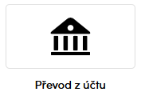
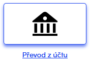

# Creating payment

You can create payment in two different ways:

1. the payment will be created by redirecting user to payment gate, the data will be sent by POST parameters
2. create payment using our API and then redirect user to payment gate, it's recommended way if you want to customize the way how to display payment methods

## Usage

| parameter | description |
| --- | --- |
| amount | Amount to pay in cents |
| currency | Currency code |
| uid | unique ID for payment |

The rest of parameters can be set via setters *todo: link somewhere?*

Let's prepare payment of 1 CZK:

```php
   $params = new \ThePay\ApiClient\Model\CreatePaymentParams(100, 'CZK', '20200101000001');
```

### Redirect user to gate without payment method

```php
    $button = $client->getPaymentButton($params);
```

### Redirect user to gate with specific payment method and/or specify custom button attributes

```php
    $paymentMethodCode = 'mojeplatba';
    $buttonAttributes = array('class' => 'btn btn-success');
    $button = $client->getPaymentButton($params, 'Button text', true, $paymentMethodCode, $buttonAttributes);
```

### Redirect user to gate with payment method selected

Method **getPaymentButtons** returns HTML code with form sended by click on payment link button.

```php
    /** @var string $paymentButtons */
    // used default rendering
    $paymentButtons = $client->getPaymentButtons($params);
    // Filter payment methods by tag. If tags are empty, all available methods will be displayed.
    $onlyMethodsWithTags = array(
        \ThePay\ApiClient\ValueObject\PaymentMethodTag::ONLINE,
    );
    $onlyMethodsWithoutTags = array(
        \ThePay\ApiClient\ValueObject\PaymentMethodTag::ALTERNATIVE_METHOD,
    );
    // used filtered methods
    // only payment methods matched used filter will be rendered in HTML,
    // but be still available for user in payment process!
    $filter = new \ThePay\ApiClient\Filter\PaymentMethodFilter(array(), $onlyMethodsWithTags, $onlyMethodsWithoutTags);
    $paymentButtons = $client->getPaymentButtons($params, $filter);
    // used without css styles
    // third bool parameter disable default css styles and javascript for payment method buttons
    // css styles are rendered in <style> tag in begin of rendered HTML
    // if default styles are disabled some custom styles must be implemented
    $paymentButtons = $client->getPaymentButtons($params, null, false);
```

Payment method buttons should look like this, second image is with hover.




#### Buttons css customization

Example of rendered HTML for one button, values with **some** word can dynamically change in HTML rendering.

```html
<style type="text/css">
    /* Some our css styles */
</style>
<script type="text/javascript">
    /* Some our JavaScript code */
</script>
<form action="..." method="post" id="some-unique-form-id">
    <!-- Some our hidden data to send with form -->
</form>
<div class="tp-btn-grid">
    <a href="..." class="tp-btn" thepay-data-attributes >
        <span class="tp-icon">
            
        </span>
        <span class="tp-title" role="note">
            Převod z účtu
        </span>
    </a>
</div>
```

To render buttons without default inline styles and javascript,
set **$useInlineAssets** parameter to false and join CSS and JS on your own.

!!! Don't forget to add JavaScript file when you disable inline assets !!!

```php
    // The third parameter disables joining inline styles and javascript
    echo $client->getPaymentButtons($params, null, false);
```

Adding thepay javascript to your own package
```javascript
require('__thpay_api_location__/assets/dist/thepay')
```

To modify default styles, set **$useInlineAssets** parameter to **false**
and use our scss package which is located at **assets/scss/thepay.scss**
and customize our default variables located at **assets/scss/_variables.scss**

```scss
// Custom gray color
$tp-gray: #999999;
// Custom default border radius
$tp-base-radius:5px;
// Custom basic spacing e.g. between buttons
$tp-spacing: 0.75rem;
// Import thepay scss package to make the magic
@import "__thepay_api_location__/assets/scss/thepay";
```

If buttons are not rendered on screen as in image example or something on page is broken,
can be collision in page css and our default css.
If collision on your page cannot be easy solved,
we recommend disable our css and implement some css on your own.
If even our HTML is not suitable for you we recommend create payment via API.

### Via API

```php
    /** @var \ThePay\ApiClient\Model\CreatePaymentResponse $response */
    $response = $client->createPayment($params);
```

*CreatePaymentResponse* has two properties with url for redirection user to payment gate:

- getPayUrl() for url where user can make payment
- getPaymentDetailUrl() for url where are details about payment and user can make payment as well

TODO: doplnit obrázky, kam se uživatel dostane kterou url
