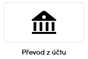
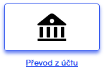

# Creating payment

The payment is created via the REST API, after which the customer is typically redirected to the URL provided in the response.

## Usage

| parameter    | description                  |
|--------------|------------------------------|
| amount       | Amount to pay in cents       |
| currency     | Currency code                |
| uid          | Unique ID of payment         |
| customer     | Customer information         |
| languageCode | Customer language (optional) |

The rest of parameters can be set via setters,
look at [CreatePaymentParams model](../src/Model/CreatePaymentParams.php).

The example below demonstrates how to create a payment of 100 CZK for a customer:

```php
/** @var \ThePay\ApiClient\Model\CreatePaymentCustomer $customer */

$paymentParams = new \ThePay\ApiClient\Model\CreatePaymentParams(
    amount: 10000, // amount in cents
    currencyCode: 'CZK',
    uid: 'uid123',
    customer: $customer
);

/** @var \ThePay\ApiClient\Model\CreatePaymentResponse $payment */
$payment = $thePayClient->createPayment($paymentParams);

// Optional additional parameters
$paymentParams->setOrderId('15478'); // Custom order ID
$paymentParams->setDescriptionForCustomer('Payment for items on example.com');
$paymentParams->setDescriptionForMerchant('Payment from VIP customer XYZ');

// Redirect URLs for the customer to complete the payment
$redirectLink = $payment->getPayUrl(); // Direct payment page
// $redirectLink = $payment->getPaymentDetailUrl(); // Payment details page (also allows completion)
```
Notes on AMOUNT:
- Payment amount must be specified in *cents*. For CZK: 1 CZK = 100 haléřů.

Notes on URLs:
- getPayUrl() - The URL where the customer can directly proceed with the payment.
- getPaymentDetailUrl() - The URL showing the current payment state and details; the customer can also complete the payment from this page.

Optional Descriptions
- Descriptions for the customer and merchant are optional but recommended for clarity.

### Payment method

When creating a payment, you can either let the customer choose the payment method at ThePay gateway, or you can preselect a method in your application.
- **Without preselection** — no payment method is set during payment creation.
  The customer will be asked to choose a method directly in the ThePay gateway.
  *(This is the default behavior.)*
- **With preselection** — you define the payment method in your e-shop.
  This can be done immediately when creating the payment, or later by updating the payment before it is completed.

For details and examples of fetching available methods, preselecting a method, changing it, or preventing customers from changing it, see [Managing payment methods](../doc/managing-payment-methods.md).

### Payment Customer

When creating a payment customer, the full name and at least one contact method are required. You can provide either an email address or a phone number.

```php
$customer = new \ThePay\ApiClient\Model\CreatePaymentCustomer(
    'Mike',
    'Smith',
    'mike.smith@universal-acceptance-test.icu', // Email (optional if phone is provided)
    '420589687963', // Phone number in international format https://en.wikipedia.org/wiki/MSISDN (max 15 numeric characters)
    new Address('CZ', 'Prague', '123 00', 'Downstreet 5') // Billing address
);
```

### Payment language

If you know the customer’s preferred language, you can specify it when creating a payment by passing the language code as the fifth argument of the `CreatePaymentParams` constructor:

```php
$params = new CreatePaymentParams(10520, 'EUR', 'uid123', $customer, 'en');
```

Language codes follow the ISO 639-1 standard.
- If you provide a language not supported by ThePay, the interface will default to English.
- If the customer has already chosen a language in ThePay, their personal setting will take precedence.
- If no language is provided, ThePay will use the language defined in your TheConfig. If that is also not set, the default will be Czech (cs).

### Obtaining Payment Buttons

You can either render your own payment method buttons (recommended for full customization), or use the built-in method **getPaymentButtonsForPayment**, which returns ready-to-use HTML:

```php
$paymentButtons = $thePayClient->getPaymentButtonsForPayment($paymentUid);
```

The default buttons look like this (the second image shows the hover state):




#### Buttons CSS customization

Example of rendered HTML for one button (values marked with **some** can change dynamically):

```html
<style type="text/css">
    /* Some default ThePay CSS styles */
</style>
<script type="text/javascript">
    /* Some default ThePay JavaScript code */
</script>
<div class="tp-btn-grid">
    <a href="..." class="tp-btn" thepay-data-attributes >
        <span class="tp-icon">
            
        </span>
        <span class="tp-title" role="note">
            Převod z účtu
        </span>
    </a>
</div>
```

By default, the generated buttons include inline styles and JavaScript.
If you want full control over the styling and script loading, set the **$useInlineAssets** parameter to *false* when retrieving the buttons:

```php
// The second parameter disables joining inline styles and JavaScript
echo $thePayClient->getPaymentButtonsForPayment($params, false);
```

⚠️ Important: If you disable inline assets, you must include ThePay’s JavaScript manually:

```javascript
require('__thpay_api_location__/assets/dist/thepay')
```

#### Customizing styles with SCSS

To override default styles, disable inline assets and use our SCSS package:
- SCSS source: assets/scss/thepay.scss
- Variables for customization: assets/scss/_variables.scss

```scss
// Custom gray color
$tp-gray: #999999;

// Custom default border radius
$tp-base-radius: 5px;

// Custom basic spacing e.g. between buttons
$tp-spacing: 0.75rem;

// Import ThePay SCSS package
@import "__thepay_api_location__/assets/scss/thepay";
```

#### Handling CSS conflicts

If the buttons don’t render correctly (e.g., layout breaks or styles differ from the preview images), it may be caused by conflicts between your CSS and ThePay’s default styles.
In such cases, we recommend disabling ThePay’s CSS entirely and implementing your own styling.
