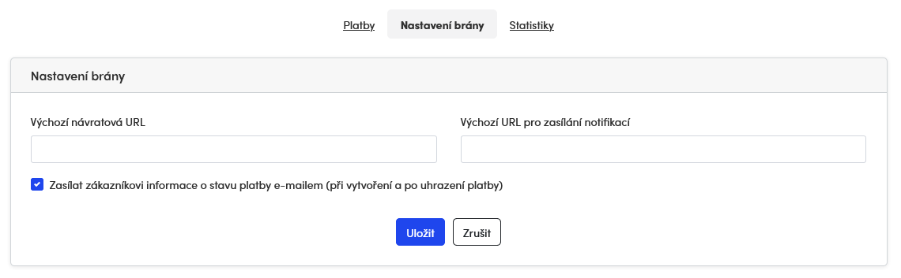

# Notifications

If state of the payment changes you will get a notification to a specified url. Please set up default value in administration:



This value may be overridden for each payment in CreatePaymentParams by setNotifUrl() function.

There are two query parameters added to notifications url:

* payment_uid
* project_id

In most cases you want to check the state of payment after getting notification:

```php
use ThePay\ApiClient\TheConfig;
use ThePay\ApiClient\TheClient;
use ThePay\ApiClient\Model\CreatePaymentParams;

$uid = $_GET["payment_uid"];
$projectId = $_GET["project_id"];

$merchantId = '86a3eed0-95a4-11ea-ac9f-371f3488e0fa';
$apiPassword = 'secret';
$apiUrl = 'https://demo.api.thepay.cz/'; // production: 'https://api.thepay.cz/'
$gateUrl = 'https://demo.gate.thepay.cz/'; // production: 'https://gate.thepay.cz/'

$config = new TheConfig($merchantId, $projectId, $apiPassword, $apiUrl, $gateUrl);
$thePay = new TheClient($config);

$payment = $thePay->getPayment($uid);
if ($payment->getState() === 'paid') {
    // send email to customer
}
```
