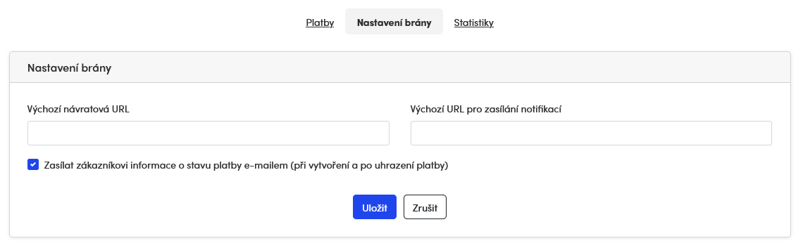

# Notifications

When the state of a payment changes, ThePay sends a notification to a specified URL.

## Configuration

You can configure the default notification URL in the administration panel:



This default URL can be **overridden for individual payments** using the `setNotifUrl()` method in `CreatePaymentParams`.

## Notification Parameters

| Parameter | Description |
|------------|-------------|
| `payment_uid` | The unique identifier (UID) of the payment. |
| `project_id` | The project identifier. |
| `type` | The notification type. See [Notification types enum](https://thepay.docs.apiary.io/#introduction/enums/notification-types). |

In most cases you want to check the state of payment after getting notification:

## Example: Handling a Payment Notification

After receiving a notification, you typically want to check the current state of the payment.
> See [how to make TheClient](../.github/README.md#theclient-instance).

```php
$uid = $_GET["payment_uid"];
$projectId = $_GET["project_id"];

$merchantId = '86a3eed0-95a4-11ea-ac9f-371f3488e0fa';
$apiPassword = 'secret';
$apiUrl = 'https://demo.api.thepay.cz/'; // production: 'https://api.thepay.cz/'
$gateUrl = 'https://demo.gate.thepay.cz/'; // production: 'https://gate.thepay.cz/'

$config = new \ThePay\ApiClient\TheConfig($merchantId, $projectId, $apiPassword, $apiUrl, $gateUrl);

/** @var \ThePay\ApiClient\Service\ApiService $apiService */
$thePayClient = new \ThePay\ApiClient\TheClient($config, $apiService);

$payment = $thePayClient->getPayment($uid);
if ($payment->getState() === 'paid') {
    // Example action: send confirmation email to customer
}
```

## Best Practice: Filter by Notification Type

You can reduce unnecessary API calls by handling only certain types of notifications — for example, `state_changed` events.

```php
$uid = $_GET["payment_uid"];
$projectId = $_GET["project_id"];
$type = $_GET["type"];

// Handle only "state_changed" notifications
if ($type === "state_changed") {
    $merchantId = '86a3eed0-95a4-11ea-ac9f-371f3488e0fa';
    $apiPassword = 'secret';
    $apiUrl = 'https://demo.api.thepay.cz/'; // production: 'https://api.thepay.cz/'
    $gateUrl = 'https://demo.gate.thepay.cz/'; // production: 'https://gate.thepay.cz/'

    $config = new \ThePay\ApiClient\TheConfig($merchantId, $projectId, $apiPassword, $apiUrl, $gateUrl);

    /** @var \ThePay\ApiClient\Service\ApiService $apiService */
    $thePayClient = new \ThePay\ApiClient\TheClient($config, $apiService);

    $payment = $thePayClient->getPayment($uid);
    if ($payment->getState() === 'paid') {
        // Example action: send confirmation email to customer
    }
}
```

## ✅ Summary
- Set a default notification URL in the admin, or override it per payment with `setNotifUrl()`.
- Notifications include `payment_uid`, `project_id`, and `type` parameters.
- Use the notification to fetch and check payment state.
- Optionally filter by notification type (e.g., `state_changed`) to optimize performance.
